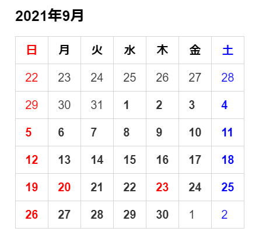

# <font color="red">cal</font><font color="blue">ma</font>

[](https://github.com/ddddddO/calma/releases) [](https://pkg.go.dev/github.com/ddddddO/calma) [](https://github.com/ddddddO/calma/actions/workflows/ci.yaml)

> [!WARNING]
>Only for Japan

Calendar for Markdown<br>
Inspired by **[_y-yagi/jpcal_](https://github.com/y-yagi/jpcal)**<br>
Can be used with [esa](https://esa.io/)<br>

## Usage

```console
$ calma -h
This CLI outputs Japanese calendar in Markdown. It supports national holidays.

Usage of /tmp/go-build2828539375/b001/exe/main:
  -a int
        Number of months to advance
  -html
        Output html
  -parallel
        Parallel processing (performance deteriorates)
  -r int
        Number of months to retreat
  -version
        Show the version

$ calma
#### 2021年9月
<font color="red">日</font>|月|火|水|木|金|<font color="blue">土</font>
--------|--------|--------|--------|--------|--------|--------
 <font color="red">22</font> | 23 | 24 | 25 | 26 | 27 | <font color="blue">28</font> 
 <font color="red">29</font> | 30 | 31 | <b>1 | <b>2 | <b>3 | <font color="blue"><b>4</font> 
 <font color="red"><b>5</font> | <b>6 | <b>7 | <b>8 | <b>9 | <b>10 | <font color="blue"><b>11</font> 
 <font color="red"><b>12</font> | <b>13 | <b>14 | <b>15 | <b>16 | <b>17 | <font color="blue"><b>18</font> 
 <font color="red"><b>19</font> | <font color="red"><b>20</font> | <b>21 | <b>22 | <font color="red"><b>23</font> | <b>24 | <font color="blue"><b>25</font> 
 <font color="red"><b>26</font> | <b>27 | <b>28 | <b>29 | <b>30 | 1 | <font color="blue">2</font> 
```

Markdown output image<br>


## Installation

### Go (1.16 or higher)

```console
$ go install github.com/ddddddO/calma/cmd/calma@latest
```

### Go (1.15 or less)

```console
$ go get github.com/ddddddO/calma/cmd/calma
```

### Homebrew

```console
$ brew install ddddddO/tap/calma
```

### Scoop

```console
$ scoop bucket add ddddddO https://github.com/ddddddO/scoop-bucket.git
$ scoop install ddddddO/calma
```

### deb
```console
$ export CALMA_VERSION=X.X.X
$ curl -o calma.deb -L https://github.com/ddddddO/calma/releases/download/v$CALMA_VERSION/calma_$CALMA_VERSION-1_amd64.deb
$ dpkg -i calma.deb
```

### rpm
```console
$ export CALMA_VERSION=X.X.X
$ yum install https://github.com/ddddddO/calma/releases/download/v$CALMA_VERSION/calma_$CALMA_VERSION-1_amd64.rpm
```

### apk
```console
$ export CALMA_VERSION=X.X.X
$ curl -o calma.apk -L https://github.com/ddddddO/calma/releases/download/v$CALMA_VERSION/calma_$CALMA_VERSION-1_amd64.apk
$ apk add --allow-untrusted calma.apk
```

### etc

**download binary from [here](https://github.com/ddddddO/calma/releases).**

## Miscellaneous
```console
$ calma -html
<h4>2022年6月</h4>

<table>
<thead>
<tr>
<th><font color="red">日</font></th>
<th>月</th>
<th>火</th>
<th>水</th>
<th>木</th>
<th>金</th>
<th><font color="blue">土</font></th>
</tr>
</thead>

<tbody>
<tr>
<td><font color="red">22</font></td>
<td>23</td>
<td>24</td>
<td>25</td>
<td>26</td>
<td>27</td>
<td><font color="blue">28</font></td>
</tr>

<tr>
<td><font color="red">29</font></td>
<td>30</td>
<td>31</td>
<td><b>1</td>
<td><b>2</td>
<td><b>3</td>
<td><font color="blue"><b>4</font></td>
</tr>

<tr>
<td><font color="red"><b>5</font></td>
<td><b>6</td>
<td><b>7</td>
<td><b>8</td>
<td><b>9</td>
<td><b>10</td>
<td><font color="blue"><b>11</font></td>
</tr>

<tr>
<td><font color="red"><b>12</font></td>
<td><b>13</td>
<td><b>14</td>
<td><b>15</td>
<td><b>16</td>
<td><b>17</td>
<td><font color="blue"><b>18</font></td>
</tr>

<tr>
<td><font color="red"><b>19</font></td>
<td><b>20</td>
<td><b>21</td>
<td><b>22</td>
<td><b>23</td>
<td><b>24</td>
<td><font color="blue"><b>25</font></td>
</tr>

<tr>
<td><font color="red"><b>26</font></td>
<td><b>27</td>
<td><b>28</td>
<td><b>29</td>
<td><b>30</td>
<td>1</td>
<td><font color="blue">2</font></td>
</tr>

<tr>
<td><font color="red">3</font></td>
<td>4</td>
<td>5</td>
<td>6</td>
<td>7</td>
<td>8</td>
<td><font color="blue">9</font></td>
</tr>
</tbody>
</table>
```

## Stargazers over time
[](https://starchart.cc/ddddddO/calma)
